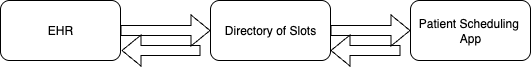
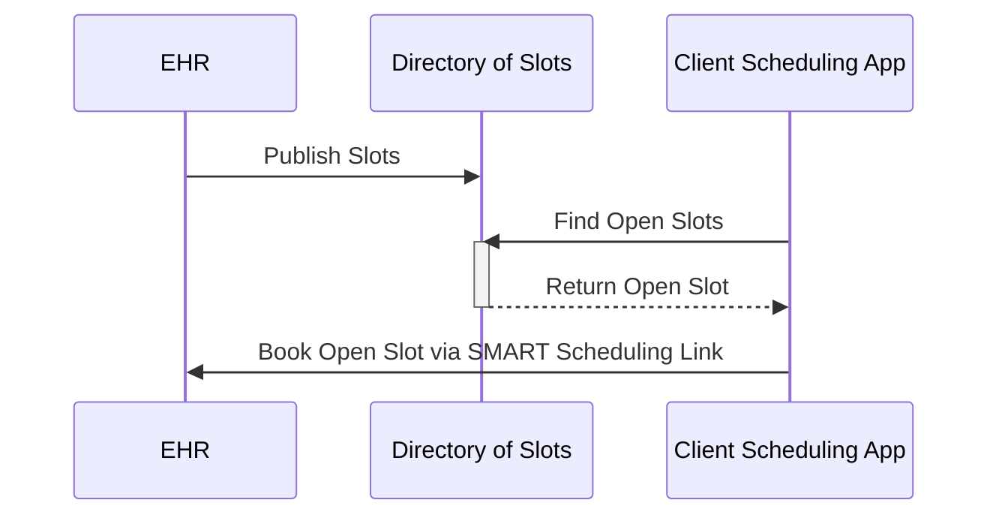

# Slot Publisher API

This guide explains how a _Slot Publisher_ makes an appointment slots available across multiple EHRS or bookings portals to a _Slot Discovery Client_.  **For background and role definitions, see [README.md](./README.md)**.


## Goals for Slot Discovery

* **Low implementation effort** -- publishers can expose available slots with nothing more than static web hosting (e.g., from a cloud storage bucket or off-the-shelf web server)
* **Scales up and down** -- publishers can expose information about a individual providers with a few slots, or large-scale programs such as nationwide pharmacies or mass vaccination sites
* **Progressive enhancement** -- publishers can expose coarse-grained data like "we have 20 slots available today" or fine-grained data with specific timing for each slot, and can expose slots for any relevant actor for Schedule
* **Builds on standards** -- publishers expose data according to the FHIR standard, but don't need specific experience with FHIR to follow this guide

## Scheduling Architecture at a High Level

**Key Actors**

 

 * **Slot Publisher** -- EHRs or booking portals provide a list of the available providers and slots that are available via provider organizations.  This will include all the available FHIR resources including practitioner, practitioner role, health service, location, and organizations.  Slot publishers will make vias avaiable via bulk publish speficiation. 

 * **Directories** -- Could be a directory of slots or can include complete provider directories.  This actor will serve as both a client and servier will consume the slots via the bulk publish API. Publishers can expose available slots with nothing more than static web hosting (e.g., from a cloud storage bucket or off-the-shelf web server).  This low effort approach does not require a full FHIR server.  

 * **Client Scheduling Applications** --Apps can then connect to the directory and find available appointments that best suite their needs eliminating the back and forth need to call providers to book appointments.  Patients or the consumer  can more easily find the best slot availale to suite their need rather a docters appointment, booking a vaccine or a vaerity of other healthcare services based on provider, location, time, find the appointment slot that best fits their need without having to pick-up the phone.

## Sequence Diagram 


 
 The EHR or booking portal will provide the data via the bulk publish to allow for NDJSON files for consumption for the directory of slots.  The directory of slots will then consume the NDJSON to make available to the client application. The directory will presnt slots to client discovery app to allow for the selection of available slots from multiple booking portals.  The slots will then available for presenation to client scheduling applications.  The patient will leverage the deep link to book directly back into the EHR or booking portal.  This light and easily approach allows for simple rendering of availabilty of many appointment types.  
 
## Quick Start Guide

A _Slot Publisher_ hosts not only appointment slots, but also Locations, PractitionerRoles, and Schedules associated with these slots:


Concretely, a _Slot Publisher_ hosts six kinds of files:
* **Practitioner,Practitinoer Role, Healthcare Service, location, scheduled, slot**

* **Bulk Publication Manifest**. The manifest is a JSON file serving as the entry point for slot discovery. It provides links that clients can follow to retrieve all the other files. The manifest is always hosted at a URL that ends with `$bulk-publish` (a convention used when publishing data sets using FHIR; this convention applies any time a potentially large data set needs to be statically published).
  * [Details on JSON structure](#manifest-file)
  * [Example file](https://raw.githubusercontent.com/smart-on-fhir/smart-scheduling-links/master/examples/$bulk-publish) showing a manifest for the fictional "SMART Medicine", a regional chain with twenty locations in Massachusetts, a mix of urgent care and primary care practices. 
* **PractitionerRole Files**.  Each line contains a minified JSON object representing a specific practitioner role that provides healthcare services where appointments are available.
  * [Details on JSON structure](#practitionerrole-file)
  * [Example file](https://raw.githubusercontent.com/smart-on-fhir/smart-scheduling-links/master/examples/practitionerroles.ndjson) showing ten practitioner roles for the fictional "SMART Primary Care". Each line provides details about a single PractitionerRole in the MA area.
* **Location Files**.  Each line contains a minified JSON object representing a physical location where appointments are available.
  * [Details on JSON structure](#location-file)

  * [Example file](https://raw.githubusercontent.com/smart-on-fhir/smart-scheduling-links/master/examples/locations.ndjson) showing ten locations for the fictional "SMART Urgent Care". Each line provides details about a single physical location in the MA area.
* **Schedule Files**.  Each line contains a minified JSON object representing the calendar for a healthcare service offered at a specific location or by a specific practitioner role.

  * [Details on JSON structure](#schedule-file)
  * [Example file](https://raw.githubusercontent.com/smart-on-fhir/smart-scheduling-links/master/examples/schedules.ndjson) showing ten schedules schedules for "SMART Primary Care" and ten schedules for "SMART Urgent Care." Each line provides details about a single schedule.
* **Slot Files**.  Each line contains a minified JSON object representing an appointment slot (busy or free) for a healthcare service at a specific location.
  * [Details on JSON structure](#slot-file)
  * [Example file](https://raw.githubusercontent.com/smart-on-fhir/smart-scheduling-links/master/examples/slots-2021-W09.ndjson) showing coarse-grained slots for a single week, across all twenty "SMART Medicine" sites. (_Note: The choice to break down slots into weekly files is arbitrary; the fictional Clinic could instead choose to host a single slot file, or produce location-specific files, or even group slots randomly._) Slots MAY include only coarse-grained timing (indicating they fall sometime beetween 9a and 6p ET, the clinic's fictional hours of operation). Ideally, Slot Publishers SHOULD provide finer-grained slot information with specific timing.

A client queries the manifest on a regular basis, e.g. once every 1-5 minutes. The client iterates through the links in the manifest file to retrieve any PractitionerRole, Location, Schedule, or Slot files it is interested in. (Clients SHOULD ignore any output items with types other than PractitionerRole, Location, Schedule, or Slot.)

### Timestamps

Wherever “timestamps” are used in this specification, they SHALL be in the format `YYYY-MM-DDThh:mm:ss.sss+zz:zz` (e.g. `2015-02-07T13:28:17.239+02:00` or `2017-01-01T00:00:00Z`). The time SHALL specified at least to the second and SHALL include a time zone offset (for UTC, the offset MAY be `Z`). These timestamps match [FHIR’s “instant” format][fhir-instant], and are also valid ISO 8601 timestamps.

### `Accept` Headers
For Bulk Publication Manifest requests, servers SHALL support at least the following `Accept` headers from a client, returning the same FHIR JSON payload in all cases:

1. No `Accept` header present
1. `Accept: application/json`

For Bulk Output File requests, servers SHALL support at least the following `Accept` headers from a client, returning the same FHIR NDJSON payload in all cases:

1. No `Accept` header present
1. `Accept: application/fhir+ndjson`

### Performance Considerations

* _Slot Publishers_ SHOULD annotate each output with a list of states or jurisdictions as a hint to clients, allowing clients to focus on fetching data for the specific states or geographical regions where they operate; this is helpful for clients with limited regions of interest.
* _Slot Publishers_ SHOULD include a [`Cache-Control: max-age=<seconds>` header](https://developer.mozilla.org/en-US/docs/Web/HTTP/Caching) as a hint to clients about how long (in seconds) to wait before polling next. For example, `Cache-Control: max-age=300` indicates a preferred polling interval of five minutes.
* Clients SHOULD NOT request a manifest or any individual data file more than once per minute
* Clients MAY include standard HTTP headers such as `If-None-Match` or `If-Modified-Since` with each query to prevent retrieving data when nothing has changed since the last query.
* Clients MAY include a `?_since={}` query parameter with a [timestamp](#timestamps) when retrieving a manifest file to request only changes since a particular point in time. Servers are free to ignore this parameter, meaning that clients should be prepared to retrieve a full data set.

### Access Control Considerations

* _Slot Publishers_ SHOULD host `$bulk-publish` content at open, publicly accessible endpoints when sharing general healthcare appointment availability (no required access keys or client credentials). This pattern ensures that data can be used widely and without pre-coordination to meet public health and consumer access use cases.
  * These data will be publicly available downstream in consumer-facing apps, so confidentiality is a non-goal.
  * Healthcare access goals require flexibility in access to non-confidential scheduling information.
  * With the `$bulk-publish` pattern, _Slot Publishers_ host static files, which scale well to open publication

### API Testing

You can test your implementation with https://inferno.healthit.gov/suites/smart_scheduling_links


## Manifest File

The manifest file is the entry point for a client to retrieve scheduling data. The manifest JSON file includes:

| field name | type | description |
|---|---|---|
| `transactionTime`  | [timestamp](#timestamps) as string | the time when this data set was published. See ["timestamps"](#timestamps) for correct formatting. |
| `request` | url as string |  the full URL of the manifest |
| `output` | array of JSON objects | each object contains a `type`, `url`, and `extension` field |
| &nbsp;&nbsp;&rarr;&nbsp;`type` | string | whether this output item represents a `"PractitionerRole"`,`"Location"`, `"Schedule"`, or `"Slot"` file |
| &nbsp;&nbsp;&rarr;&nbsp;`url` | url as string | the full URL of an NDJSON file for the specified type of data |
| &nbsp;&nbsp;&rarr;&nbsp;`extension` | JSON object | contains tags to help a client decide which output files to download |
| &nbsp;&nbsp;&rarr;&nbsp;&nbsp;&nbsp;&rarr;&nbsp;`state` | JSON array of strings | state or jurisdiction abbreviations (e.g., `["MA"]` for a file with data pertaining solely to Massachusetts) |

(For more information about this manifest file, see the [FHIR bulk data spec](http://build.fhir.org/ig/HL7/bulk-data/branches/bulk-publish/bulk-publish.html).)

### Example Manifest File

```js
{

  "transactionTime": "2021-01-01T00:00:00Z",
  "request": "https://example.com/covid-vaccines/$bulk-publish",
  "output": [
    {
      "type": "Schedule",
      "url": "https://example.com/data/schedule_file_1.ndjson"
    },
        {
      "type": "PractitionerRole",
      "url": "https://example.com/data/practitionerrole_file_1.ndjson"
    },
    {
      "type": "Location",
      "url": "https://example.com/data/location_file_1.ndjson"
    },
    {
      "type": "Slot",
      "url": "https://example.com/data/slot_file_MA.ndjson",
      "extension": {
        "state": ["MA"]
      }
    },
    {
      "type": "Slot",
      "url": "https://example.com/data/slot_file_NEARBY.ndjson",
      "extension": {
        "state": ["CT", "RI", "NH"]
      }
    }
  ],
  "error": []
}
```

## Location File


Each line of the Location File is a minified JSON object that conveys a physical location where appointments are available.

Each Location includes at least:

| field name | type | required | description |
| --- | --- | :---: | --- |
| `resourceType` | string | Y | fixed value of `"Location"` |
| `id` | string | Y | unique identifier for this location (up to 64 alphanumeric characters and may include `-` and `.`) |
| `name` | string | Y | the human-readable name of the location. Name SHOULD include consumer-relevant branding (e.g., the brand name of a pharmacy chain that a consumer would be familiar with)|
| `telecom` | array of JSON objects | Y | each object conveys a contact point for this location. The array SHALL include at least one contact point, and SHOULD include both a phone number and a URL. (*Note: this field conveys "general information" contact points such as a front desk for the location, not necessarily for booking appointments; see Slot details for booking URLs and booking phone numbers*)|
| &nbsp;&nbsp;&rarr;&nbsp;`system` | string | Y | `"phone"` or `"url"`|
| &nbsp;&nbsp;&rarr;&nbsp;`value` | string | Y | phone number or URL for this location|
| `address` | JSON object | Y | each object conveys a USPS [complete address](https://pe.usps.com/text/pub28/28c2_001.htm) |
| &nbsp;&nbsp;&rarr;&nbsp;`line` | array of strings | Y | each string is line in the address |
| &nbsp;&nbsp;&rarr;&nbsp;`city` | string | Y | |  
| &nbsp;&nbsp;&rarr;&nbsp;`state` |string | Y | |
| &nbsp;&nbsp;&rarr;&nbsp;`postalCode` | string | Y | |
| &nbsp;&nbsp;&rarr;&nbsp;`district` | string | N | optional county |
| `description` | string | N | additional information about this location (e.g., where to find it) |
| `position` | JSON object | N |  geocoordinates of the location |
| &nbsp;&nbsp;&rarr;&nbsp;`latitude` | number | N | must be populated if position is included |
| &nbsp;&nbsp;&rarr;&nbsp;`longitude` | number | N | must be populatd if position is included |
| `identifier` | array of JSON objects | Y | Identifiers for this location (e.g., facility numbers, site identifiers). See below.|

Each `identifier` object includes a `system` and a `value`. 

* If a PractitionerRole or Location is associated with organization-specific identifiers (such as facility numbers, site codes, or store numbers), publishers SHOULD include these. The `system` should be a URL that identifies the identifier system, preferably a page on the publisher's web site (e.g. `{"system": "https://healthsystem.example.com/facility-directory", "value": "FAC-123"}`)

* If a Location participates in external registry programs that assign location identifiers, publishers MAY include these identifiers using the appropriate system URL for the registry.

* Additional identifiers: Any number of additional identifiers MAY be included. Each should populate `system` and `value` as appropriate, following FHIR identifier conventions.

### Example `Location`

```json
{
  "resourceType": "Location",
  "id": "123",
  "identifier": [{
    "system": "https://healthsystem.example.com/facility-directory",
    "value": "FAC-PITT-001"
  }],
  "name": "Berkshire Family Medicine - Pittsfield",
  "description": "Primary care clinic located in downtown Pittsfield",
  "telecom": [{
    "system": "phone",
    "value": "413-555-0123"
  }, {
    "system": "url",
    "value": "https://berkshirefamilymedicine.example.com"
  }],
  "address": {
    "line": ["173 Elm St"],
    "city": "Pittsfield",
    "state": "MA",
    "postalCode": "01201-7223"
  }
}
```

### Example Location File
  * Example [file](https://raw.githubusercontent.com/smart-on-fhir/smart-scheduling-links/master/examples/locations.ndjson) 


## PractitionerRole File

Each line of the PractitionerRole File is a minified JSON object that represents a set of roles/locations/specialties/services that a practitioner may perform at an organization for a period of time. The PractitionerRole resource represents the specific roles that practitioners perform at organizations where appointments are available. According to the [FHIR R4 PractitionerRole definition](https://hl7.org/fhir/R4/practitionerrole.html), practitioner roles define the specific context in which practitioners provide services, including:

* Primary care physician roles at specific locations
* Specialist roles (cardiologist, dermatologist, etc.) with specific availability
* Nursing roles for various services and locations
* Pharmacy roles for medication management and immunizations
* Therapy roles (physical therapy, occupational therapy, etc.)
* Diagnostic service roles (radiology, laboratory, etc.)
* Administrative roles that support patient care scheduling

Each PractitionerRole includes at least:

| field name | type | required | description |
| --- | --- | :---: | --- |
| `resourceType` | string | Y | fixed value of `"PractitionerRole"` |
| `id` | string | Y | unique identifier for this practitioner role (up to 64 alphanumeric characters and may include `-` and `.`) |
| `identifier` | array of JSON objects | N | Business identifiers that are specific to a role/location |
| `active` | boolean | N | Whether this practitioner role is in active use |
| `period` | JSON object | N | The period during which the person is authorized to act as a practitioner in these role(s) for the organization |
| &nbsp;&nbsp;&rarr;&nbsp;`start` | [timestamp](#timestamps) as string | N | Start time with inclusive boundary |
| &nbsp;&nbsp;&rarr;&nbsp;`end` | [timestamp](#timestamps) as string | N | End time with inclusive boundary, if not ongoing |
| `practitioner` | JSON object | N | Practitioner that is able to provide the defined services for the organization |
| &nbsp;&nbsp;&rarr;&nbsp;`reference` | string | N | Reference to a Practitioner resource (e.g., `"Practitioner/dr-smith"`) |
| &nbsp;&nbsp;&rarr;&nbsp;`display` | string | N | Text alternative for the resource |
| `organization` | JSON object | N | Organization where the roles are available |
| &nbsp;&nbsp;&rarr;&nbsp;`reference` | string | N | Reference to an Organization resource |
| &nbsp;&nbsp;&rarr;&nbsp;`display` | string | N | Text alternative for the resource |
| `code` | array of JSON objects | N | Roles which this practitioner may perform |
| &nbsp;&nbsp;&rarr;&nbsp;`coding` | array of JSON objects | N | Coded representation of the role |
| &nbsp;&nbsp;&rarr;&nbsp;&nbsp;&nbsp;&rarr;&nbsp;`system` | string | N | The code system (e.g., `"http://snomed.info/sct"`) |
| &nbsp;&nbsp;&rarr;&nbsp;&nbsp;&nbsp;&rarr;&nbsp;`code` | string | N | The role code |
| &nbsp;&nbsp;&rarr;&nbsp;&nbsp;&nbsp;&rarr;&nbsp;`display` | string | N | Human-readable description of the role |
| `specialty` | array of JSON objects | N | Specific specialty of the practitioner |
| &nbsp;&nbsp;&rarr;&nbsp;`coding` | array of JSON objects | N | Coded representation of the specialty |
| &nbsp;&nbsp;&rarr;&nbsp;&nbsp;&nbsp;&rarr;&nbsp;`system` | string | N | The code system (e.g., `"http://snomed.info/sct"`) |
| &nbsp;&nbsp;&rarr;&nbsp;&nbsp;&nbsp;&rarr;&nbsp;`code` | string | N | The specialty code |
| &nbsp;&nbsp;&rarr;&nbsp;&nbsp;&nbsp;&rarr;&nbsp;`display` | string | N | Human-readable description of the specialty |
| `location` | array of JSON objects | N | The location(s) at which this practitioner provides care |
| &nbsp;&nbsp;&rarr;&nbsp;`reference` | string | N | Reference to a Location resource (e.g., `"Location/clinic-a"`) |
| &nbsp;&nbsp;&rarr;&nbsp;`display` | string | N | Text alternative for the resource |
| `healthcareService` | array of JSON objects | N | The list of healthcare services that this worker provides for this role's Organization/Location(s) |
| &nbsp;&nbsp;&rarr;&nbsp;`reference` | string | N | Reference to a HealthcareService resource |
| &nbsp;&nbsp;&rarr;&nbsp;`display` | string | N | Text alternative for the resource |
| `telecom` | array of JSON objects | N | Contact details that are specific to the role/location/service |
| &nbsp;&nbsp;&rarr;&nbsp;`system` | string | N | `"phone"`, `"email"`, or `"url"` |
| &nbsp;&nbsp;&rarr;&nbsp;`value` | string | N | phone number, email address, or URL for this practitioner role |
| `availableTime` | array of JSON objects | N | Times the practitioner is available at this location/service (if not specified, then these times are the default for all services) |
| &nbsp;&nbsp;&rarr;&nbsp;`daysOfWeek` | array of strings | N | Days of the week. Values: `"mon"`, `"tue"`, `"wed"`, `"thu"`, `"fri"`, `"sat"`, `"sun"` |
| &nbsp;&nbsp;&rarr;&nbsp;`allDay` | boolean | N | Always available? e.g. 24 hour service |
| &nbsp;&nbsp;&rarr;&nbsp;`availableStartTime` | string | N | Opening time of day (ignored if allDay = true) |
| &nbsp;&nbsp;&rarr;&nbsp;`availableEndTime` | string | N | Closing time of day (ignored if allDay = true) |
| `notAvailable` | array of JSON objects | N | Not available during this period of time due to the provided reason |
| &nbsp;&nbsp;&rarr;&nbsp;`description` | string | Y | Reason presented to the user explaining why time not available |
| &nbsp;&nbsp;&rarr;&nbsp;`during` | JSON object | N | Service not available from this date/time |
| &nbsp;&nbsp;&rarr;&nbsp;&nbsp;&nbsp;&rarr;&nbsp;`start` | [timestamp](#timestamps) as string | N | Starting time with inclusive boundary |
| &nbsp;&nbsp;&rarr;&nbsp;&nbsp;&nbsp;&rarr;&nbsp;`end` | [timestamp](#timestamps) as string | N | End time with inclusive boundary |

Each `identifier` object includes a `system` and a `value`. 

* If a PractitionerRole is associated with organization-specific identifiers (such as role-specific employee numbers, provider numbers, or location-specific identifiers), publishers SHOULD include these. The `system` should be a URL that identifies the identifier system, preferably a page on the publisher's web site (e.g. `{"system": "https://healthsystem.example.com/practitioner-role-directory", "value": "ROLE-123"}`)

* **National Provider Identifier (NPI)**: Publishers SHALL include the practitioner's NPI when available, using the system `"http://hl7.org/fhir/sid/us-npi"` and the 10-digit NPI number as the value (e.g. `{"system": "http://hl7.org/fhir/sid/us-npi", "value": "1234567890"}`)

* If a PractitionerRole participates in external registry programs that assign role-specific identifiers, publishers MAY include these identifiers using the appropriate system URL for the registry.

* Additional identifiers: Any number of additional identifiers MAY be included. Each should populate `system` and `value` as appropriate, following FHIR identifier conventions.

### Example `PractitionerRole`

```json
{
  "resourceType": "PractitionerRole",
  "id": "doc-smith-role",
  "identifier": [{
    "system": "https://healthsystem.example.com/practitioner-role-directory",
    "value": "ROLE-12345"
  }, {
    "system": "http://hl7.org/fhir/sid/us-npi",
    "value": "1234567890"
  }],
  "active": true,
  "period": {
    "start": "2020-01-01"
  },
  "practitioner": {
    "reference": "Practitioner/doc-smith",
    "display": "Dr. John Robert Smith"
  },
  "organization": {
    "reference": "Organization/berkshire-family-medicine",
    "display": "Berkshire Family Medicine"
  },
  "code": [{
    "coding": [{
      "system": "http://snomed.info/sct",
      "code": "309343006",
      "display": "Physician"
    }]
  }],
  "specialty": [{
    "coding": [{
      "system": "http://snomed.info/sct",
      "code": "394802001",
      "display": "General medicine"
    }]
  }],
  "location": [{
    "reference": "Location/123",
    "display": "Berkshire Family Medicine - Pittsfield"
  }],
  "telecom": [{
    "system": "phone",
    "value": "413-555-0123"
  }, {
    "system": "email",
    "value": "appointments@berkshirefamilymedicine.example.com"
  }],
  "availableTime": [{
    "daysOfWeek": ["mon", "tue", "wed", "thu", "fri"],
    "availableStartTime": "09:00:00",
    "availableEndTime": "17:00:00"
  }]
}
```

### Example PractitionerRole File
  * Example [file](https://raw.githubusercontent.com/smart-on-fhir/smart-scheduling-links/master/examples/practitionerroles.ndjson)

# Practitioner File  

| **Field Name** | **Type** | **Required** | **Description** |
| --- | --- | --- | --- |
| `resourceType` | string | Y | Fixed value of `"Practitioner"` |
| `id` | string | Y | Unique identifier for this practitioner (up to 64 alphanumeric characters and may include `-` and `.`) |
| `identifier` | array of JSON objects | N | An identifier for the person as this agent |
| → `use` | string | N | `"usual"`, `"official"`, `"temp"`, `"secondary"`, `"old"` |
| → `system` | string | N | The namespace for the identifier value (e.g., `"http://hl7.org/fhir/sid/us-npi"`) |
| → `value` | string | N | The value that is unique within the system |
| `active` | boolean | N | Whether this practitioner's record is in active use |
| `name` | array of JSON objects | N | The name(s) associated with the practitioner |
| → `use` | string | N | `"usual"`, `"official"`, `"temp"`, `"nickname"`, `"anonymous"`, `"old"`, `"maiden"` |
| → `text` | string | N | Full text representation of the name |
| → `family` | string | N | Family name (surname) |
| → `given` | array of strings | N | Given names (not always 'first'). Includes middle names |
| → `prefix` | array of strings | N | Parts that come before the name (e.g., `"Dr."`, `"Prof."`) |
| → `suffix` | array of strings | N | Parts that come after the name (e.g., `"Jr."`, `"MD"`) |
| → `period` | JSON object | N | Time period when name was/is in use |
| →   → `start` | timestamp as string | N | Start time with inclusive boundary |
| →   → `end` | timestamp as string | N | End time with inclusive boundary |
| `telecom` | array of JSON objects | N | Contact details for the practitioner (e.g., phone, email) |
| → `system` | string | N | `"phone"`, `"fax"`, `"email"`, `"pager"`, `"url"`, `"sms"`, `"other"` |
| → `value` | string | N | The actual contact point details |
| → `use` | string | N | `"home"`, `"work"`, `"temp"`, `"old"`, `"mobile"` |
| → `rank` | integer | N | Specify preferred order of use (1 = highest) |
| → `period` | JSON object | N | Time period when the contact point was/is in use |
| →   → `start` | timestamp as string | N | Start time with inclusive boundary |
| →   → `end` | timestamp as string | N | End time with inclusive boundary |
| `address` | array of JSON objects | N | Address(es) of the practitioner |
| → `use` | string | N | `"home"`, `"work"`, `"temp"`, `"old"`, `"billing"` |
| → `type` | string | N | `"postal"`, `"physical"`, `"both"` |
| → `text` | string | N | Full text representation of the address |
| → `line` | array of strings | N | Street name, number, direction & P.O. Box etc. |
| → `city` | string | N | Name of city, town etc. |
| → `district` | string | N | District name (aka county) |
| → `state` | string | N | Sub-unit of country (abbreviations ok) |
| → `postalCode` | string | N | Postal code for area |
| → `country` | string | N | Country (e.g. can be ISO 3166 2 or 3 letter code) |
| → `period` | JSON object | N | Time period when

## Schedule File

Each line of the Schedule File is a minified JSON object that conveys information about a Schedule to which slots are attached. The Schedule represents a particular healthcare service (e.g., primary care appointments, specialist consultations, or procedures) offered at a specific location or by a specific practitioner role.

Each Schedule includes at least:

<table>
	<tr><th>field name</th><th>type</th><th>description</th></tr>
	<tr><td><code>resourceType</code></td><td>string</td><td>fixed value of <code>"Schedule"</code></td></tr>
	<tr><td><code>id</code></td><td>string</td><td>a unique identifier for this schedule (up to 64 alphanumeric characters and may include <code>-</code> and <code>.</code>)</td></tr>
	<tr><td><code>actor</code></td><td>array of JSON objects</td><td>References to the primary resource(s) that the schedule is providing availability for. This array can contain multiple actors, commonly including both Location and PractitionerRole references to indicate appointments for a specific practitioner role at a specific location.</td></tr>
	<tr><td>&nbsp;&nbsp;&rarr;&nbsp;<code>reference</code></td><td>string</td><td>Reference to a Location, PractitionerRole, or other resource. Use <code>Location</code> + <code>/</code> + the <code>id</code> value (e.g., <code>"Location/123"</code>) for location references and <code>PractitionerRole</code> + <code>/</code> + the <code>id</code> value (e.g., <code>"PractitionerRole/doc-smith-role"</code>) for practitioner role references. Multiple references can be included to represent schedules that are associated with both a specific practitioner role and a specific location.</td></tr>
	<tr><td>&nbsp;&nbsp;&rarr;&nbsp;<code>display</code></td><td>string</td><td>Human-readable label for the referenced actor. For a <code>Location</code>, populate with <code>Location.name</code>. For a <code>PractitionerRole</code>, populate with <code>PractitionerRole.practitioner.display</code>. Including <code>display</code> helps clients render schedules without dereferencing actors.</td></tr>
	<tr><td><code>serviceType</code></td><td>array of JSON objects</td><td>Each object is a standardized concept indicating what services are offered. The serviceType should use appropriate coding systems such as SNOMED CT or the HL7 service-type code system. For example, a general practice appointment schedule might include:
		<pre>[{
  "system": "http://terminology.hl7.org/CodeSystem/service-type",
  "code": "124",
  "display": "General Practice"
}]
</pre>
		For immunization services, you might use:
		<pre>[{
  "system": "http://terminology.hl7.org/CodeSystem/service-type",
  "code": "57",
  "display": "Immunization"
}]
</pre>
		Additional <code>serviceType</code>s may be included if this schedule offers multiple services; or additional <code>coding</code>s may be included to convey more nuanced information about the services offered. Multiple codings can express different levels of specificity following the FHIR convention for "codeable concepts" -- see <a href="http://hl7.org/fhir/datatypes.html#codeableconcept">here</a> for details.</td></tr>
	<tr><td><code>extension</code></td><td>array of JSON objects</td><td>see details below</td></tr>
</table>

### Multiple Actors in Schedules

Schedules can reference multiple actors in the `actor` array to provide more specific context about the healthcare service. Common patterns include:

* **Location-only schedules**: Reference only a Location resource, indicating that appointments are available at that location but not tied to a specific practitioner role.
* **PractitionerRole-only schedules**: Reference only a PractitionerRole resource, indicating appointments with that specific practitioner role regardless of location.
* **Location and PractitionerRole schedules**: Reference both Location and PractitionerRole resources, indicating appointments for a specific practitioner role at a specific location. This is useful for:
  - Multi-location practices where practitioner roles work at different sites
  - Specialty clinics where specific practitioner roles provide services at designated locations
  - Healthcare systems where practitioner role schedules vary by location

When multiple actors are specified, all referenced resources apply to the schedule and its associated slots.

### Schedule Extensions
	
Each Schedule object may optionally include extension JSON objects in the Schedule's `extension` array to provide additional context about the healthcare services offered. Common extensions might include:

* **Specialty extension**: Used to indicate the medical specialty associated with this schedule. This helps clients categorize and filter schedules by practitioner role specialty or service area.

	| field name | type  | description |
	|---|---|---|
	|`url`| string | fixed value of `"http://fhir-registry.smarthealthit.org/StructureDefinition/specialty"`|
	|`valueCoding` | JSON object | A coded value representing the medical specialty |
	| &nbsp;&nbsp;&rarr;&nbsp;`system` | string | The code system (e.g., `"http://snomed.info/sct"` for SNOMED CT) |
	| &nbsp;&nbsp;&rarr;&nbsp;`code` | string | The specialty code |
	| &nbsp;&nbsp;&rarr;&nbsp;`display` | string | Human-readable description of the specialty |

* **Service Category extensions**: Used to provide additional categorization of healthcare services beyond the standard serviceType codes. These can help clients filter and display services more effectively.

* **PractitionerRole extensions**: Used to indicate specific practitioner role qualifications or specializations required for appointments on this schedule (e.g., board certifications, special training, location-specific credentials).

Extensions should follow FHIR extension conventions and use appropriate extension URLs. Implementers may define custom extensions as needed for their specific use cases, following FHIR extension guidelines.

### Example `Schedule`

```json
{
  "resourceType": "Schedule",
  "id": "456",
  "serviceType": [
    {
      "coding": [
        {
          "system": "http://terminology.hl7.org/CodeSystem/service-type",
          "code": "124",
          "display": "General Practice"
        }
      ]
    }
  ],
  "actor": [
    {
      "reference": "Location/123",
      "display": "Berkshire Family Medicine - Pittsfield"
    },
    {
      "reference": "PractitionerRole/doc-smith-role",
      "display": "Dr. John Robert Smith"
    }
  ],
  "extension": [
    {
      "url": "http://fhir-registry.smarthealthit.org/StructureDefinition/specialty",
      "valueCoding": {
        "system": "http://snomed.info/sct",
        "code": "394802001",
        "display": "General medicine"
      }
    }
  ]
}
```

This example demonstrates a Schedule with multiple actors, indicating that general practice appointments are available for practitioner role "doc-smith-role" at location "123". This pattern is commonly used when a specific practitioner role provides services at a specific location.

### Example Schedule File
  * Example [file](https://raw.githubusercontent.com/smart-on-fhir/smart-scheduling-links/master/examples/schedules.ndjson) 


## Slot File

Each line of the Slot File is a minified JSON object that conveys information about an appointment slot. Publishers are encouraged to represent slots with fine-grained timing details (e.g.  representing appointments at specific times of the day), but MAY represent slots with coarse grained timing (e.g., "between 9 a.m. and 5 p.m." or "between noon and five p.m.").

*Note: When publishing a Slot with `"status": "free"`, Publishers should ensure that the Slot is in fact available for booking, given current business rules. For example, if a provider requires certain prerequisites to be met before an appointment can be booked (such as referrals, prior authorization, or specific patient eligibility criteria), then the provider SHOULD NOT advertise the slot as available unless those requirements are satisfied.*

Each `Slot` has:

| field name | type | required | description |
|---|---|:---:|---|
| `resourceType` | string | Y | fixed value of `"Slot"` |
| `id` | string | Y | a unique identifier for this slot (up to 64 alphanumeric characters and may include `-` and `.`) |
| `schedule` | JSON object | Y | has a single field indicating the Schedule this slot belongs to |
| &nbsp;&nbsp;&rarr;&nbsp;`reference` | string | Y | the schedule for this slot formed as `Schedule` + `/` + the `id` value of an entry in a Schedule File (e.g., `"Schedule/123"`). |
| `status` | string | Y | `"free"`, `"busy"`, `"busy-tentative"`, or `"busy-unavailable"`. The `"busy-tentative"` status indicates a slot is temporarily held (see [Find → Hold → Book Pattern](#find--hold--book-pattern)). |
| `start` | [timestamp](#timestamps) as string | Y | the start time of this slot. Together `start` and `end` SHOULD identify a narrow window of time for the appointment, but MAY be as broad as the clinic's operating hours for the day, if the publisher does not support fine-grained scheduling. Timestamp SHALL be expressed with an accurate offset suffix, which SHOULD reflect the local timezone offset of the Location this slot belongs to (e.g., `-05:00` suffix for UTC-5) or use UTC (i.e., `Z` suffix). For example, to represent a start time of 10:45AM in America/New_York on 2021-04-21, this could be returned as either `2021-04-21T10:45:00.000-04:00` or `2021-04-21T14:45:00.000Z`.|
| `end` | [timestamp](#timestamps) as string | Y | the end time of this slot. See notes about offset suffix for `start`.|
| `extension` | array of JSON objects | N | see details below |

Each Slot object may optionally include one or both of the following extension JSON objects in the Slot's `extension` array.

* "Booking link" extension: used to convey a web link into the Provider Booking Portal (see [below](#deep-links-hosted-by-provider-booking-portal)) where the user can begin booking this slot.

	| field name | type  | description |
	|---|---|---|
	|`url`| string | fixed value of `"http://fhir-registry.smarthealthit.org/StructureDefinition/booking-deep-link"`|
	|`valueUrl` | string | URL that's a deep link into the Provider Booking Portal |

* "Booking phone" extension: used to convey a phone number the user can call to book this slot.

	| field name | type  | description |
	|---|---|---|
	|`url`| string | fixed value of `"http://fhir-registry.smarthealthit.org/StructureDefinition/booking-phone"`|
	|`valueString` | string | Phone number the user can call to book this slot.


### Example `Slot`
```json
{
  "resourceType": "Slot",
  "id": "789",
  "schedule": {
    "reference": "Schedule/456"
  },
  "status": "free",
  "start": "2021-03-10T15:00:00-05",
  "end": "2021-03-10T15:20:00-05",
  "extension": [{
    "url": "http://fhir-registry.smarthealthit.org/StructureDefinition/booking-deep-link",
    "valueUrl": "https://ehr-portal.example.org/bookings?slot=opaque-slot-handle-89172489"
  }]
}
```

### Example Slot File
  * Example [file](https://raw.githubusercontent.com/smart-on-fhir/smart-scheduling-links/master/examples/slots-2021-W09.ndjson)

## Healthcare Service Resource

The Health Service resource is used to describe a single healthcare service or category of services that are provided by an organization at a location. The location of the services could be virtual, as with telemedicine services. This profile provides a scheduling-optimized view of healthcare service offerings, enabling discovery and booking of appointments when no specific practitioner is required or specified.

| Field Name | Type | Required | Description |
|------------|------|----------|-------------|
| `id` | id | Yes | Logical identifier for the health service |
| `active` | boolean | Yes | Whether the service is currently active and available for scheduling |
| `providedBy` | Reference(Organization) | No | Organization that provides this service |
| `category` | CodeableConcept | No | Broad categorization of the service (e.g., Primary Care, Allied Health, Mental Health) |
| `type` | CodeableConcept | Yes | Specific type of service offered (e.g., Physical Therapy, Vaccination, Emergency Services) |
| `specialty` | CodeableConcept | Yes | Clinical specialty required to perform the service (e.g., Cardiology, General Practice) |
| `location` | Reference(Location) | Yes | Physical or virtual location(s) where service is provided |
| `name` | string | Yes | Human-readable name of the service for display purposes |
| `comment` | string | No | Additional description or instructions relevant to scheduling (e.g., "Walk-in available", "Referral required") |
| `telecom` | ContactPoint | No | Contact information for the service (phone, email, website) |
| `serviceProvisionCode` | CodeableConcept | No | Conditions under which service is available (e.g., free, fees apply, by referral only) |
| `appointmentRequired` | boolean | No | Whether an appointment is required for this service (false indicates walk-in accepted) |
| `availableTime` | BackboneElement | No | General times the service is available at the location |
| `availableTime.daysOfWeek` | code | No | Days of week service is available (mon, tue, wed, thu, fri, sat, sun) |
| `availableTime.allDay` | boolean | No | Service available all day during specified days |
| `availableTime.availableStartTime` | time | No | Opening time of day (ignored if allDay = true) |
| `availableTime.availableEndTime` | time | No | Closing time of day (ignored if allDay = true) |
| `notAvailable` | BackboneElement | No | Exception periods when the service is not available |
| `notAvailable.description` | string | Yes* | Reason service is not available (*required if notAvailable is present) |
| `notAvailable.during` | Period | No | Specific time period when service is unavailable |

### Example Health Service


```json
{
  "resourceType": "HealthcareService",
  "id": "online-primary-care",
  "active": true,
  "providedBy": {
    "reference": "Organization/acme-health",
    "display": "ACME Health System"
  },
  "category": [{
    "coding": [{
      "system": "http://terminology.hl7.org/CodeSystem/service-category",
      "code": "17",
      "display": "General Practice"
    }]
  }],
  "type": [{
    "coding": [{
      "system": "http://snomed.info/sct",
      "code": "308335008",
      "display": "Patient encounter procedure"
    }],
    "text": "Primary Care Visit"
  }],
  "specialty": [{
    "coding": [{
      "system": "http://snomed.info/sct",
      "code": "394814009",
      "display": "General practice"
    }]
  }],
  "location": [{
    "reference": "Location/main-clinic",
    "display": "Main Street Clinic"
  }],
  "name": "Primary Care Appointments - Online Booking",
  "comment": "Book your primary care appointment online. Appointments available with next available provider. For urgent needs, please call our office or visit urgent care.",
  "telecom": [{
    "system": "phone",
    "value": "(555) 123-4567",
    "use": "work"
  }, {
    "system": "email",
    "value": "appointments@acmehealth.org",
    "use": "work"
  }, {
    "system": "url",
    "value": "https://appointments.acmehealth.org",
    "use": "work"
  }],
  "serviceProvisionCode": [{
    "coding": [{
      "system": "http://terminology.hl7.org/CodeSystem/service-provision-conditions",
      "code": "cost",
      "display": "Fees apply"
    }]
  }],
  "appointmentRequired": true,
  "availableTime": [{
    "daysOfWeek": ["mon", "tue", "wed", "thu", "fri"],
    "availableStartTime": "08:00:00",
    "availableEndTime": "17:00:00"
  }],
  "availabilityExceptions": "Closed on major holidays. Online booking available 24/7 for future appointments."
}
  

### Deep Links hosted by Provider Booking Portal

The Booking Portal is responsible for handling incoming deep links.

Each Slot exposed by the Slot Publisher can include an extension indicating the Booking Deep Link, a URL that the Slot Discovery Client can redirect a user to. The Slot Discovery Client can attach the following URL parameters to a Booking Deep Link:

* `source`: a correlation handle indicating the identity of the Slot Discovery Client, for use by the Provider Booking Portal in tracking the source of incoming referrals.
* `booking-referral`: a correlation handle for this specific booking referral. This parameter can optionally be retained by the Provider Booking Portal throughout the booking process, which can subsequently help the Slot Discovery Client to identify booked slots. (Details for this lookup are out of scope for this specification.)

### Example of deep linking into a booking portal

For the `Slot` example above, a client can construct the following URL to provide a deep link for a user to book a slot:

1. Parse the Booking Deep Link URL
2. Optionally append `source`
3. Optionally append `booking-referral`

In this case, if the `source` value is `source-abc` and the `booking-referral` is `34d1a803-cd6c-4420-9cf5-c5edcc533538`, then the fully constructed deep link URL would be:

    https://ehr-portal.example.org/bookings?slot=opaque-slot-handle-89172489&source=source-abc&booking-referral=34d1a803-cd6c-4420-9cf5-c5edcc533538

(Note: this construction is *not* as simple as just appending `&source=...` to the booking-deep-link, because the booking-deep-link may or may not already include URL parameters. The Slot Discovery Client must take care to parse the booking-deep-link and append parameters, e.g., including a `?` prefix if not already present.)

## Find → Hold → Book Pattern

### Principle

This specification adheres to general guidance in FHIR scheduling to implement a **Find, Hold, Book** pattern for appointment booking. This pattern provides a robust workflow that minimizes booking conflicts while maintaining the scalability benefits of static slot publication.

### Workflow Overview

The recommended appointment booking workflow follows these stages:

1. **Find**: Slot Discovery Clients discover available slots through the bulk publication manifest and static slot files
2. **Hold**: When a user initiates booking, the Provider Booking Portal places a temporary hold on the selected slot within the scheduling system's source of truth
3. **Book**: The user completes the booking process, converting the held slot to a confirmed appointment

### Hold Implementation Strategy

This specification recognizes that Slot Publishers and Provider Booking Portals are typically **the same organizational entity** serving different functional roles from a **unified scheduling system**, or at least both have direct access to the underlying source of truth. This unified model resolves potential consistency challenges:

- **Immediate hold creation**: When a hold is placed via the Provider Booking Portal, it updates the underlying scheduling database
- **Publication at publisher's discretion**: The next publication cycle reflects hold status changes (slots with `"status": "busy-tentative"`) in the static files
- **Ecosystem consistency**: All discovery clients eventually see consistent hold state within the established polling intervals

### Hold Initiation

Provider Booking Portals SHOULD initiate slot holds automatically when:

- A user lands on a booking deep link and begins the appointment booking flow
- The booking process requires multiple steps or user input that may take significant time
- The risk of slot conflicts justifies the overhead of hold management

Holds provide a critical user experience improvement by reducing booking failures due to concurrent access while the user is actively engaged in the booking process.

### Architectural Separation

This approach maintains clean separation of concerns:

- **Static file servers** (serving scheduling links) remain focused on high-performance, cacheable content delivery and are **not involved in state management**
- **Dynamic booking systems** handle all stateful operations including holds, appointments, and real-time scheduling coordination
- **Single source of truth** ensures that both static publication and dynamic booking operations reflect the same underlying scheduling state

The _Provider Booking Portal_ is responsible for initiating holds within the scheduling system's source of truth, with the _Slot Publisher_ reflecting these state changes in subsequent publications at its discretion based on publication frequency and caching strategies.

## Slot Aggregators

Systems that re-publish data from other _Slot Publishers_ are referred to as _Slot Aggregators_. If you are a _Slot Aggregator_, you may wish to use some additional extensions and FHIR features to supply useful provenance information or describe ways that your aggregated data may not exactly match the definitions in the _SMART Scheduling Links_ specification. The practices and approaches in this section are _recommendations_; none are _required_ for a valid implementation.


### Preserve Source Identifiers

_Slot Aggregators_ usually need to assign new `id` values to resources in order to make sure they are unique across the aggregated dataset. The `id` of the original resource SHOULD be preserved in the `identifier` list, alongside the identifiers from the original resource. The specific `system` and `value` used for the identifier is left up to the implementer.

For example, given this Location resource from an underlying source:

```js
{
  "resourceType": "Location",
  "id": "123",
  "identifier": [
    {
      "system": "https://healthsystem.example.com/facility-directory",
      "value": "FAC-PITT-001"
    }
  ],
  "name": "Berkshire Family Medicine - Pittsfield",
  // additional Location fields here...
}
```

A _Slot Aggregator_ might publish a Location like:

```js
{
  "resourceType": "Location",
  "id": "456",
  "identifier": [
    {
      "system": "https://healthsystem.example.com/facility-directory",
      "value": "FAC-PITT-001"
    },
    {
      "system": "https://berkshirefamilymedicine.example.org/",
      "value": "123"
    }
  ],
  "name": "Berkshire Family Medicine - Pittsfield",
  // additional Location fields here...
}
```

In this example, `https://berkshirefamilymedicine.example.org/` is an arbitrary string that defines “Flynn’s Pharmacy” as the identifier system. _Slot Aggregators_ should only use a URL that is not under their control in cases where the URL is predictable and might reasonably be chosen by other _Slot Aggregators_. When this is not the case, _Slot Aggregators_ SHOULD choose a URL under their control. For example, an aggregator at `usdr.example.org` might choose a URL like `https://usdr.example.org/fhir/identifiers/flynns`.

When the source system is a SMART Scheduling Links implementation, a _Slot Aggregator_ SHOULD use [FHIR’s `Resource.meta.source` field][resource_meta] to describe it. The value is a URI that SHOULD include the URL of the source system, and MAY add the resource `id`.

For example, given the above example resource at `https://api.flynnspharmacy.example.org/fhir/smart-scheduling/$bulk-publish`, a _Slot Aggregator_ might publish a location like:

```js
{
  "resourceType": "Location",
  "id": "456",
  "meta": {
    "source": "https://api.flynnspharmacy.example.org/fhir/smart-scheduling/Location/123"
  },
  "identifier": [
    {
      "system": "https://cdc.gov/vaccines/programs/vtrcks",
      "value": "CV1654321"
    },
    {
      "system": "https://flynnspharmacy.example.org/",
      "value": "123"
    }
  ],
  "name": "Flynn's Pharmacy in Pittsfield, MA",
  // additional Location fields here...
}


### Indicate Data “Freshness”

Aggregators may request or receive information from publishers at different times, and understanding how recently data about a Location, Schedule, or Slot was retrieved can help end users gauge the accuracy of items in an aggregated dataset. _Slot Aggregators_ SHOULD use the `lastSourceSync` extension on the `meta` field of any resource to indicate the last time at which the data was known to be accurate:

```js
{
  "resourceType": "Schedule",
  "id": "123",
  "meta": {
    "extension": [{
      "url": "http://hl7.org/fhir/StructureDefinition/lastSourceSync",
      "valueDateTime": "2021-04-19T20:35:05.000Z"
    }]
  }
  // additional Schedule fields here...
}
```

### Describe Unknown Availability, Capacity, or Slot Times

Because source systems may experience errors or may not conform to the SMART Scheduling Links specification, _Slot Aggregators_ need additional tools to describe unusual situations that are not relevant to first-party _Slot Publishers_. Specifically, _Slot Aggregators_ may describe Schedules where:
- Whether any Slots are associated with the Schedule is unknown (e.g. because a source system is unreachable),
- The capacity or times of Slots are unknown (e.g. slots are known to be free or busy only _at some time_ in the near future).

Use the **optional "Has Availability" extension** to convey that a Schedule has non-zero or unknown future availability, without conveying details about when or how much. When used on a Schedule, that Schedule MAY have no associated Slots. _Slot Publishers_ SHALL NOT use this capacity in place of publishing granular Slots; it is defined to support Slot Aggregators (i.e. systems that re-publish Slot data from other APIs).

| field name | type  | description |
|---|---|---|
|`url`| string | Fixed value of `"http://fhir-registry.smarthealthit.org/StructureDefinition/has-availability"` |
|`valueCode` | string | One of: <ul><li>`"some"`: The Schedule has non-zero future availability.</li><li>`"none"`: The Schedule has no future availability.</li><li>`"unknown"`: The schedule has unknown future availability (e.g. because there is no source of data for this schedule or because the source system had errors or was unparseable).</li></ul> |

Example usage on a Schedule:

```json
{
  "resourceType": "Schedule",
  "id": "456",
  "serviceType": [
    {
      "coding": [
        {
          "system": "http://terminology.hl7.org/CodeSystem/service-type",
          "code": "124",
          "display": "General Practice"
        }
      ]
    }
  ],
  "extension": [
    {
      "url": "http://fhir-registry.smarthealthit.org/StructureDefinition/has-availability",
      "valueCode": "some"
    }
  ],
  "actor": [
    {
      "reference": "Location/123"
    }
  ]
}
```


[resource_meta]: http://hl7.org/fhir/resource.html#Meta
[fhir-instant]: http://hl7.org/fhir/datatypes.html#instant
